# xiaomi-latte-postmarketos
Guide how-to flash PostmarketOS to Xiaomi Mi Pad 2 (latte)

# Agreement
I am not responsible for any damage done to your device neither to you or your environment because of potentially bricked device. By doing steps in this guide you agree with this statement and you do everything on your own risk.

# References
* postmarketos (https://postmarketos.org/)
* QuickSwift315490 - added support for `latte` device (https://github.com/Qs315490/xiaomi-latte-flash_tools)

# Environment
* Arch Linux
* Unlocked Xiaomi Mi Pad 2 (I do not remember how I did it 8 years ago), 16G version

# Required software
Install few packages:
```
$ sudo pacman -S kpartx multipath-tools android-tools
```
Test that you have python3 installed:
```
$ python --version
Python 3.14.2
```
(here and below your output may vary slightly)

# Prepare pmbootstrap
```
$ cd ~
$ mkdir _latte
$ cd ~/_latte
$ git clone https://gitlab.postmarketos.org/postmarketOS/pmbootstrap.git
$ cd ~/_latte/pmbootstrap
$ git checkout 3.8.0
$ git status
HEAD detached at 3.8.0
nothing to commit, working tree clean
$ cd ~/_latte
$ mkdir pmbootstrap_work
```

# Init build tree
Important: do not select `charging` in `postmarketos-usb-moded-default-profile`, keep default value. In my case OTG keyboard did not work when I set `charging` here.
* for work path set `~/_latte/pmbootstrap_work`
* for vendor type `xiaomi`
* for device type `latte`
* for user type `user`. First time I was doing it system did not work with custom name (some GUI services require `user` to start)
* for extra packages nice-to-have are `vim,mc`
* for desktop I selected `gnome-mobile`. Were not enough space for `plasma-desktop`. `plasma-mobile` works but I use GNOME because I am more familiar with it. `gnome-desktop` is the same, just different layout I think. Also PLASMA is heavier, in my case image was bigger: 3.9G vs 2.9G. It is around 7% of total space because of partitioning (14.1G available for /).
```
$ cd ~/_latte/pmbootstrap_work

$ python3 ../pmbootstrap/pmbootstrap.py init
[11:45:49] Location of the 'work' path. Multiple chroots (native, device arch, device rootfs) will be created in there.
[11:45:49] Work path [/home/xvoidee/.local/var/pmbootstrap]: ~/_latte/pmbootstrap_work
[11:46:16] Location of the 'pmaports' path, containing package definitions.
[11:46:16] pmaports path [/home/xvoidee/_latte/pmbootstrap_work/cache_git/pmaports]: 
[11:46:25] Setting up the native chroot and cloning the package build recipes (pmaports)...
[11:46:25] Clone git repository: https://gitlab.postmarketos.org/postmarketOS/pmaports.git
Cloning into '/home/xvoidee/_latte/pmbootstrap_work/cache_git/pmaports'...
[11:46:50] Choose the postmarketOS release channel.
[11:46:50] Available (13):
[11:46:50] * edge: Rolling release / Most devices / Occasional breakage: https://postmarketos.org/edge
[11:46:50] * v25.12: Latest release / Recommended for best stability
[11:46:50] * v25.06: Old release (supported until 2026-01-23)
[11:46:50] Channel [edge]: 
[11:47:26] NOTE: pmaports is on master branch, copying git hooks.
[11:47:26] Choose your target device vendor (either an existing one, or a new one for porting).
[11:47:26] Available vendors (103): acer, alcatel, amazon, amediatech, amlogic, apple, ark, arrow, asus, ayn, bananapi, barnesnoble, beelink, blackberry, bq, clockworkpi, cubietech, cutiepi, dongshanpi, epson, essential, fairphone, finepower, fly, fxtec, generic, goclever, google, gp, hisense, htc, huawei, inet, infocus, jolla, khadas, klipad, kobo, lark, leeco, lenovo, lg, librecomputer, linksys, lynx, mangopi, medion, meizu, microsoft, mnt, mobvoi, motorola, nextbit, nobby, nokia, nothing, nvidia, odroid, oneplus, oppo, ouya, pine64, planet, pocketbook, postmarketos, powkiddy, purism, qcom, qemu, qualcomm, radxa, raspberry, realme, rockchip, samsung, semc, sharp, shift, sipeed, solidrun, sony, sourceparts, sqfmi, starway, surftab, t2m, thundercomm, tokio, tolino, trekstor, valve, vernee, vivo, volla, wd, wexler, wiko, wileyfox, xiaomi, xunlong, yu, zte, zuk
[11:47:26] Vendor [qemu]: xiaomi
[11:47:36] Devices are categorised as follows, from best to worst:
* Main: ports where mostly everything works.
* Community: often mostly usable, but may lack important functionality.
* Testing: anything from "just boots in some sense" to almost fully functioning ports.
* Downstream: ports that use a downstream kernel — very limited functionality. Not recommended.

Available devices by codename (40): armani (downstream), begonia (testing), beryllium (community), cancro (downstream), cepheus (testing), clover (testing), dior (downstream), elish (community), equuleus (testing), ferrari (downstream), fire (downstream), fog (downstream), gemini (testing), ido (downstream), jasmine_sprout (testing), lancelot (testing), latte (testing), laurel (testing), lavender (testing), libra (downstream), merlin (downstream), miatoll (testing), monet (downstream), nabu (testing), natrium (testing), olive (downstream), perseus (testing), pine (downstream), platina (testing), polaris (testing), pyxis (testing), raphael (testing), rosemary-downstream (downstream), sagit (testing), scorpio (testing), spes (downstream), tulip (testing), vayu (testing), whyred (testing), wt88047 (testing)
[11:47:36] Device codename: latte
[11:47:44] Username [user]: user
[11:48:25] Available providers for postmarketos-base-ui-audio-backend (2):
[11:48:25] * pulseaudio: Use pulseaudio as the audio backend. (default)
[11:48:25] * pipewire: Use pipewire as the audio backend. (but may not work with all devices)
[11:48:25] Provider [default]: 
[11:48:34] Available providers for postmarketos-base-ui-wifi (2):
[11:48:34] * wpa_supplicant: Use wpa_supplicant as the WiFi backend. (default)
[11:48:34] * iwd: Use iwd as the WiFi backend (but may not work with all devices)
[11:48:34] Provider [default]: 
[11:48:41] Available providers for postmarketos-usb-moded-default-profile (2):
[11:48:41] * developer: Make 'developer mode' the default usb-moded profile (always enables usb networking) (default)
[11:48:41] * charging: Make 'charging mode' the default usb-moded profile (usb networking must be manually enabled)
[11:48:41] Provider [default]: 
[11:49:14] Update package index for x86_64 (5 file(s))
  0%                                                                                                               [sudo] password for xvoidee: 
[11:49:21] Available user interfaces (30): 
[11:49:21] * none: Bare minimum OS image for testing and manual customization. The "console" UI should be selected if a graphical UI is not desired.
[11:49:21] * asteroid: (Wayland) Smartwatch UI from AsteroidOS
[11:49:21] * buffyboard: Plain framebuffer console with modern touchscreen keyboard support
[11:49:21] * cage: (Wayland) Kiosk WM
[11:49:21] * console: Console environment, with no graphical/touch UI
[11:49:21] * cosmic: COSMIC Desktop Environment from System76
[11:49:21] * fbkeyboard: Plain framebuffer console with touchscreen keyboard support
[11:49:21] * gnome: (Wayland) Gnome Shell
[11:49:21] * gnome-mobile: (Wayland) Gnome Shell patched to adapt better to phones (Experimental)
[11:49:21] * i3wm: (X11) Tiling WM (keyboard required)
[11:49:21] * kodi: (GBM) 10-foot UI useful on TV's
[11:49:21] * lomiri: (Wayland) The convergent desktop environment (Experimental)
[11:49:21] * lxqt: (X11) Lightweight Qt Desktop Environment (stylus recommended)
[11:49:21] * mate: (X11) MATE Desktop Environment, fork of GNOME2 (stylus recommended)
[11:49:21] * mediaberry: (Wayland) An open platform for streaming boxes and smart TVs (WIP)
[11:49:21] * moonlight: (Wayland) Open Source PC client for NVIDIA GameStream, as used by the NVIDIA Shield
[11:49:21] * niri: (Wayland) A scrollable-tiling compositor (DOES NOT RUN WITHOUT HW ACCELERATION!)
[11:49:21] * openbox: (X11) A highly configurable and lightweight X11 window manager (keyboard required)
[11:49:21] * os-installer: UI for installing postmarketOS
[11:49:21] * phosh: (Wayland) Mobile UI using GNOME components and apps
[11:49:21] * plasma-desktop: (Wayland) KDE Desktop Environment (works well with tablets)
[11:49:21] * plasma-mobile: (Wayland) Mobile variant of KDE Plasma
[11:49:21] * retroarch: RetroArch in KMS mode
[11:49:21] * shelli: Plain console with touchscreen gesture support
[11:49:21] * sway: (Wayland) Tiling WM, drop-in replacement for i3wm
[11:49:21] * sxmo-de-dwm: Simple Mobile: Mobile environment based on SXMO and running on dwm
[11:49:21] * sxmo-de-i3: Simple Mobile: Mobile environment based on SXMO and running on i3
[11:49:21] * sxmo-de-river: Simple Mobile: Mobile environment based on SXMO and running on river
[11:49:21] * sxmo-de-sway: Simple Mobile: Mobile environment based on SXMO and running on sway
[11:49:21] * weston: (Wayland) Reference compositor (demo, not a phone interface)
[11:49:21] * xfce4: (X11) Lightweight desktop (stylus recommended)
[11:49:21] User interface [console]: gnome-mobile
[11:50:09] Based on your UI selection, 'default' will result in installing systemd.
[11:50:09] Install systemd? (default/always/never) [default]: 
[11:50:13] Additional options: extra free space: 0 MB, boot partition size: 256 MB, parallel jobs: 8, ccache per arch: 5G, sudo timer: False, mirror: http://mirror.postmarketos.org/postmarketos/
[11:50:13] Change them? (y/n) [n]: 
[11:50:27] Additional packages that will be installed to rootfs. Specify them in a comma separated list (e.g.: vim,file) or "none"
[11:50:27] Extra packages [none]: vim,mc
[11:51:31] Your host timezone: Europe/Berlin
[11:51:31] Use this timezone instead of GMT? (y/n) [y]: 
[11:51:33] Choose your preferred locale, like e.g. en_US. Only UTF-8 is supported, it gets appended automatically. Use tab-completion if needed.
[11:51:33] Locale [en_US]: 
[11:51:35] Device hostname (short form, e.g. 'foo') [xiaomi-latte]: latte
[11:51:45] NOTE: No SSH public keys found to copy to the device.
[11:51:45] See https://postmarketos.org/ssh-key-glob for more information.
[11:51:45] After pmaports are changed, the binary packages may be outdated. If you want to install postmarketOS without changes, reply 'n' for a faster installation.
[11:51:45] Build outdated packages during 'pmbootstrap install'? (y/n) [y]: 
[11:51:48] DONE!
```

# Build image
Bootstrap will ask for your ‘host’ password (main desktop system) and for password for ‘user’ account on tablet.
```
$ cd ~/_latte
$ git clone https://github.com/Qs315490/xiaomi-latte-flash_tools
$ cd ~/_latte/xiaomi-latte-flash_tools
$ python3 gpt_ini2bin.py
$ python3 ../pmbootstrap/pmbootstrap.py install --split
[11:54:29] *** (1/4) PREPARE NATIVE CHROOT ***
[sudo] password for xvoidee: 
[11:54:33] Download http://dl-cdn.alpinelinux.org/alpine/edge/main/x86_64/apk-tools-static-3.0.3-r2.apk
[11:54:33] (native) Creating chroot
[11:54:37] (native) install cryptsetup util-linux parted
[11:54:39] *** (2/4) CREATE DEVICE ROOTFS ("xiaomi-latte") ***
[11:54:40] (rootfs_xiaomi-latte) Creating chroot
[11:54:47] (rootfs_xiaomi-latte) install postmarketos-base-systemd
[11:54:59] (rootfs_xiaomi-latte) install postmarketos-base device-xiaomi-latte postmarketos-ui-gnome postmarketos-base-ui-audio-backend-pulseaudio postmarketos-base-ui-wifi-wpa_supplicant vim mc postmarketos-base-nofde doas doas-sudo-shim gnome-calendar gnome-disk-utility gnome-extensions-app gnome-system-monitor snapshot decibels firefox-esr flatpak fprintd g4music gnome-calculator gnome-calendar gnome-clocks gnome-console gnome-contacts gnome-maps gnome-software gnome-software-plugin-apk gnome-text-editor gnome-weather gst-libav gst-plugins-bad gst-plugins-good gst-plugins-rs-dav1d gvfs-full loupe nautilus papers showtime snapshot tuned-ppd font-droid font-droid-nonlatin font-twemoji lang font-droid font-droid-nonlatin font-twemoji lang
[11:57:30] (rootfs_xiaomi-latte) install postmarketos-mkinitfs
[11:57:30] (rootfs_xiaomi-latte) mkinitfs
[11:57:31]  *** SET LOGIN PASSWORD FOR: 'user' ***
New password: 
Retype new password: 
passwd: password updated successfully
[12:01:08] NOTE: No valid keymap specified for device
[12:01:11] *** (3/4) PREPARE INSTALL BLOCKDEVICE ***
[12:01:11] (native) create xiaomi-latte-boot.img (256M)
[12:01:11] (native) create xiaomi-latte-root.img (2770M)
[12:01:11] (native) mount /dev/installp1 (xiaomi-latte-boot.img)
[12:01:13] (native) mount /dev/installp2 (xiaomi-latte-root.img)
[12:01:15] (native) install e2fsprogs
[12:01:15] (native) format /dev/installp2 (root, ext4)
[12:01:15] (native) mount /dev/installp2 to /mnt/install
[12:01:16] (native) install dosfstools
[12:01:16] (native) format /dev/installp1 (boot, fat32), mount to /mnt/install/boot
[12:01:17] (native) create /etc/fstab
[12:01:17] (rootfs_xiaomi-latte) mkinitfs
[12:01:18] *** (4/4) FILL INSTALL BLOCKDEVICE ***
[12:01:18] (native) copy rootfs_xiaomi-latte to /mnt/install/
[12:01:36] 
[12:01:36] *** FLASHING INFORMATION ***
[12:01:36] Refer to the installation instructions of your device, or the generic install instructions in the wiki.
[12:01:36] https://wiki.postmarketos.org/wiki/Installation_guide#pmbootstrap_flash
[12:01:36] 
[12:01:36] *** SSH DAEMON INFORMATION ***
[12:01:36] SSH daemon is enabled (disable with --no-sshd).
[12:01:36] Login as 'user' with the password given during installation.
[12:01:36] 
[12:01:36] *** FIREWALL INFORMATION ***
[12:01:36] Firewall is enabled, but may not work (couldn't determine if kernel supports nftables).
[12:01:36] For more information: https://postmarketos.org/firewall
[12:01:36] 
[12:01:36] NOTE: chroot is still active (use 'pmbootstrap shutdown' as necessary)
[12:01:36] DONE!
```

# Export OS image
```
$ cd ~/_latte/xiaomi-latte-flash_tools

$ python3 ../pmbootstrap/pmbootstrap.py export
[12:05:17] (rootfs_xiaomi-latte) install postmarketos-mkinitfs
[12:05:17] (rootfs_xiaomi-latte) chroot not initialized! This is a bug! Please report it.
[12:05:17] (rootfs_xiaomi-latte) initializing the chroot for you...
[12:05:18] (rootfs_xiaomi-latte) mkinitfs
[12:05:19] Export symlinks to: /tmp/postmarketOS-export
[12:05:19]  * boot.img (Fastboot compatible boot.img file, contains initramfs with bootimg header <=2 and kernel)
[12:05:19]  * vendor_boot.img (Fastboot compatible vendor_boot.img file, contains cmdline, initramfs and dtb. Only with bootimg header >= v3)
[12:05:19]  * uInitrd (Initramfs, legacy u-boot image format)
[12:05:19]  * uImage (Kernel, legacy u-boot image format)
[12:05:19]  * dtbo.img (Fastboot compatible dtbo image)
[12:05:19]  * xiaomi-latte.img (Rootfs with partitions for /boot and /)
[12:05:19]  * xiaomi-latte-boot.img (Boot partition image)
[12:05:19]  * xiaomi-latte-root.img (Root partition image)
[12:05:19]  * pmos-xiaomi-latte.zip (Android recovery flashable zip)
[12:05:19]  * lk2nd.img (Secondary Android bootloader)
[12:05:19]  * initramfs (Initramfs)
[12:05:19]  * vmlinuz (Linux kernel)
[12:05:19] NOTE: chroot is still active (use 'pmbootstrap shutdown' as necessary)
[12:05:19] DONE!
```

# Copy OS image (needed for flash)
Only 2 images are required, after copy check size - something big like 260M-3G is plausible.
```
$ cd ~/_latte/xiaomi-latte-flash_tools

$ cp -H /tmp/postmarketOS-export/xiaomi-latte-boot.img images 
$ cp -H /tmp/postmarketOS-export/xiaomi-latte-root.img images 
$ ls -la images 
total 2404160
drwxr-xr-x 2 xvoidee xvoidee       4096 Jan 18 12:37 .
drwxr-xr-x 5 xvoidee xvoidee       4096 Jan 18 11:54 ..
-rw-r--r-- 1 xvoidee xvoidee        228 Jan 18 11:54 gpt.bin
-rw-r--r-- 1 xvoidee xvoidee  268435456 Jan 18 12:37 xiaomi-latte-boot.img
-rw-r--r-- 1 xvoidee xvoidee 2904555520 Jan 18 12:37 xiaomi-latte-root.img
```

# Prepare device for flash
Press 3 buttons together:
* Volume-Up
* Volume-Down
* Power

and hold. Device will boot into DnX mode.
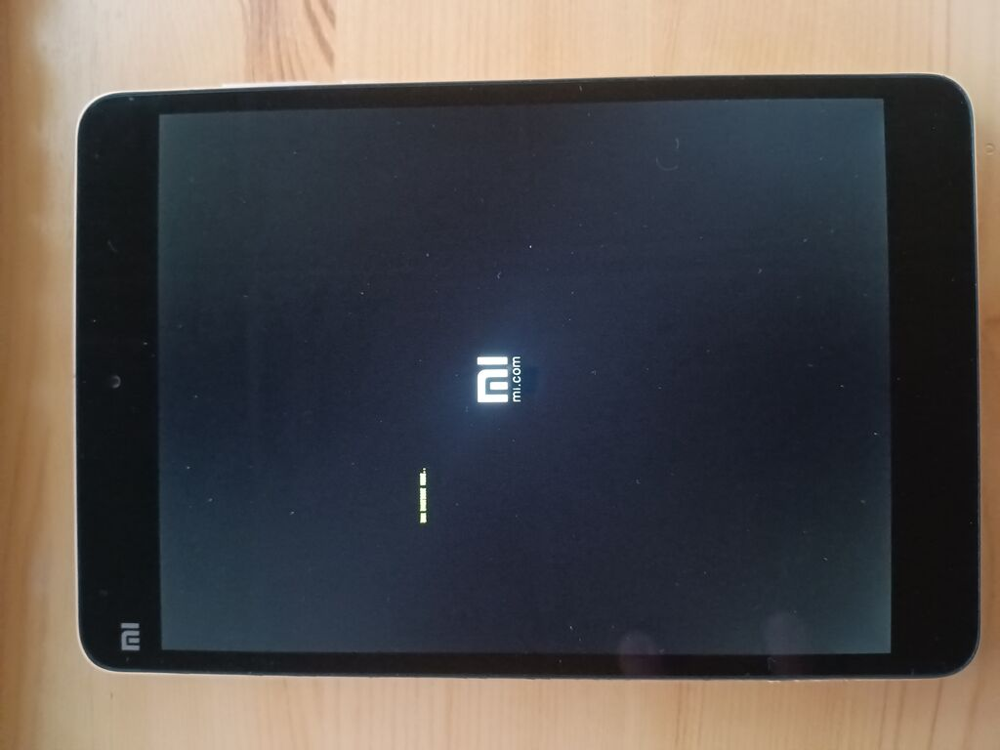
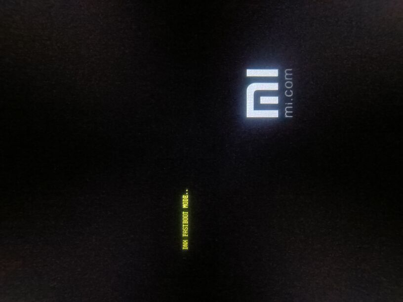

# Flash
Verify that device is connected (your output may vary):
```
$ fastboot devices
A3X429D4BE00	Fastboot
```
Switch to fastboot:
```
$ cd ~/_latte/xiaomi-latte-flash_tools

$ fastboot boot device_files/fastboot.efi
creating boot image...
creating boot image - 4577280 bytes
Sending 'boot.img' (4470 KB)                       OKAY [  0.109s]
Booting                                            OKAY [  0.003s]
Finished. Total time: 0.125s
```
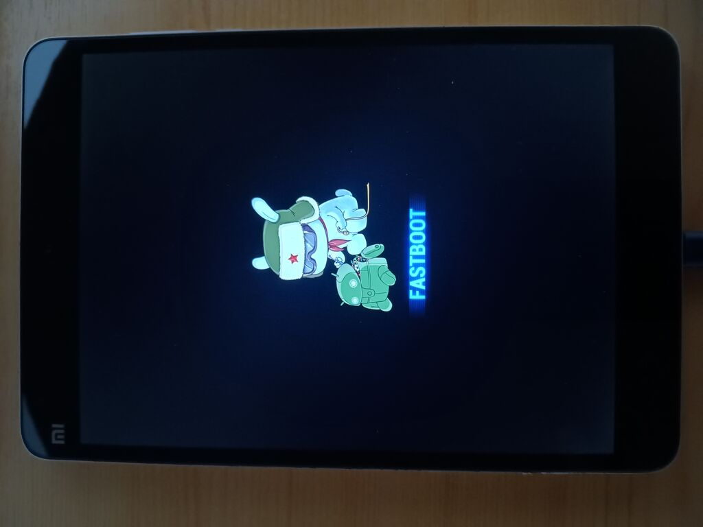

It is always good to verify that you flashing compatible product. Should be 'latte'. Otherwise it may brick your device (or will):
```
$ fastboot getvar product
product: latte
Finished. Total time: 0.033s
```
Flash step by step. Output will vary:
```
$ cd ~/_latte/xiaomi-latte-flash_tools

$ fastboot flash oemvars device_files/oemvars.txt 
Warning: skip copying oemvars image avb footer (oemvars partition size: 0, oemvars image size: 1819).
Sending 'oemvars' (1 KB)                           OKAY [  0.108s]
Writing 'oemvars'                                  OKAY [  0.081s]
Finished. Total time: 0.513s

$ fastboot flash oemvars device_files/oemvars-battery-config-fake-disabled.txt 
Warning: skip copying oemvars image avb footer (oemvars partition size: 0, oemvars image size: 85).
Sending 'oemvars' (0 KB)                           OKAY [  0.109s]
Writing 'oemvars'                                  OKAY [  0.022s]
Finished. Total time: 0.455s

$ fastboot flash oemvars device_files/oemvars-battery-config-fake.txt         
Warning: skip copying oemvars image avb footer (oemvars partition size: 0, oemvars image size: 85).
Sending 'oemvars' (0 KB)                           OKAY [  0.109s]
Writing 'oemvars'                                  OKAY [  0.022s]
Finished. Total time: 0.441s

$ fastboot flash gpt images/gpt.bin 
Warning: skip copying gpt image avb footer (gpt partition size: 0, gpt image size: 228).
Sending 'gpt' (0 KB)                               OKAY [  0.109s]
Writing 'gpt'                                      OKAY [  0.129s]
Finished. Total time: 0.574s

$ fastboot flash boot images/xiaomi-latte-boot.img 
Sending 'boot' (262144 KB)                         OKAY [  7.133s]
Writing 'boot'                                     OKAY [  6.609s]
Finished. Total time: 13.981s

$ fastboot flash system images/xiaomi-latte-root.img 
Sending sparse 'system' 1/10 (262140 KB)           OKAY [  7.139s]
Writing 'system'                                   OKAY [  9.494s]
Sending sparse 'system' 2/10 (253292 KB)           OKAY [  6.873s]
Writing 'system'                                   OKAY [  6.908s]
Sending sparse 'system' 3/10 (260626 KB)           OKAY [  7.042s]
Writing 'system'                                   OKAY [  7.693s]
Sending sparse 'system' 4/10 (258503 KB)           OKAY [  7.024s]
Writing 'system'                                   OKAY [  8.001s]
Sending sparse 'system' 5/10 (248501 KB)           OKAY [  6.772s]
Writing 'system'                                   OKAY [  7.461s]
Sending sparse 'system' 6/10 (259038 KB)           OKAY [  7.037s]
Writing 'system'                                   OKAY [  7.539s]
Sending sparse 'system' 7/10 (259300 KB)           OKAY [  7.070s]
Writing 'system'                                   OKAY [  7.180s]
Sending sparse 'system' 8/10 (261190 KB)           OKAY [  7.096s]
Writing 'system'                                   OKAY [  9.062s]
Sending sparse 'system' 9/10 (256568 KB)           OKAY [  7.027s]
Writing 'system'                                   OKAY [  8.466s]
Sending sparse 'system' 10/10 (24952 KB)           OKAY [  0.815s]
Writing 'system'                                   OKAY [ 10.973s]
Finished. Total time: 148.220s
```
And finally reboot your device:
```
$ fastboot reboot
Rebooting                                          OKAY [  0.019s]
Finished. Total time: 0.119s
```

# Disable secure boot
On first boot device most probably will fail to boot because of shim signature. Disable secure boot. To enter BIOS connect keyboard via OTG adapter, power device on and keep pressing F2 key - BIOS will pop up as usual. Then navigate to settings and disable secure boot. Do not forget to save your settings.

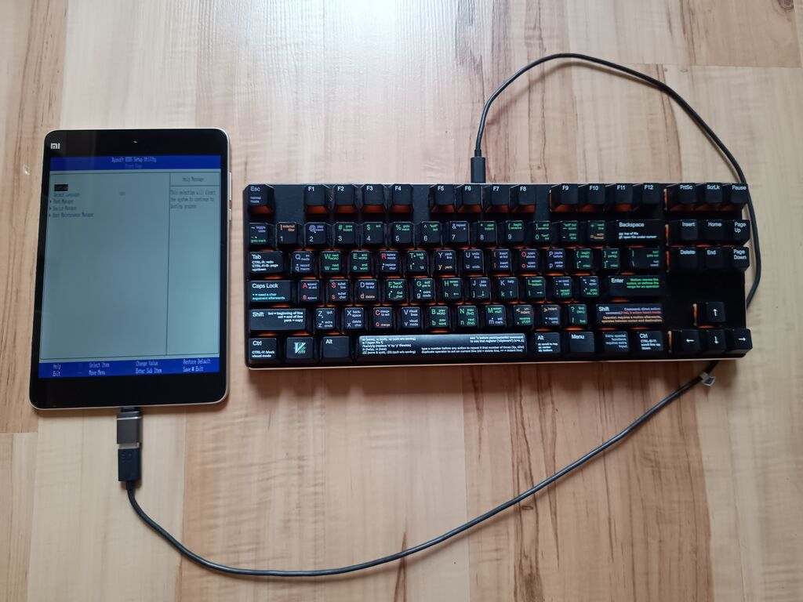
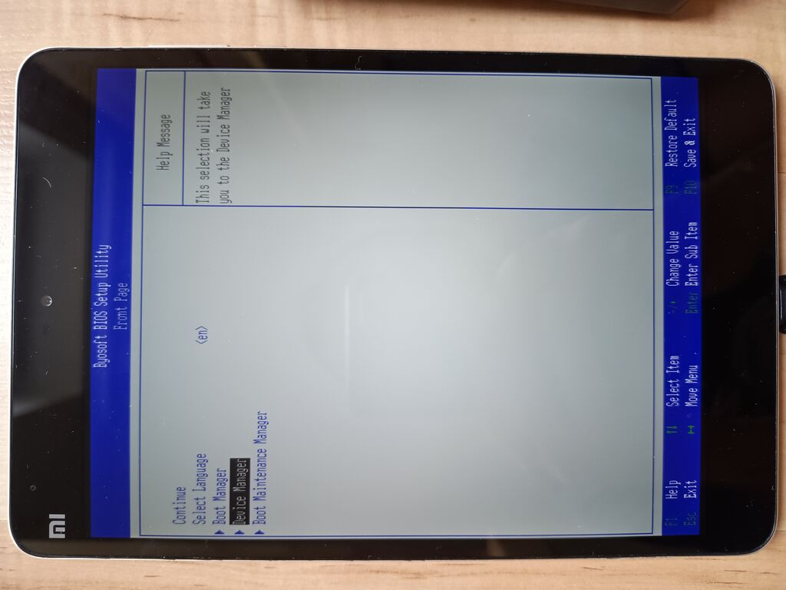
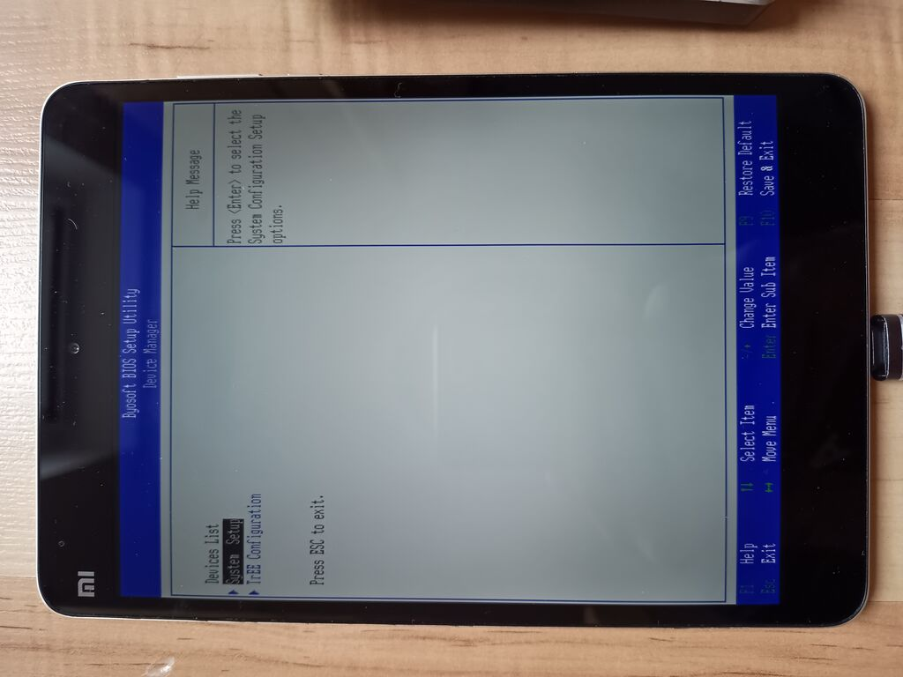
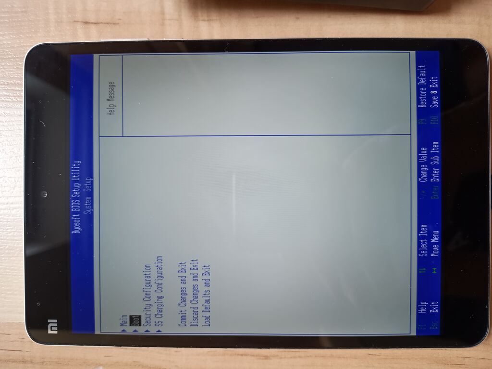
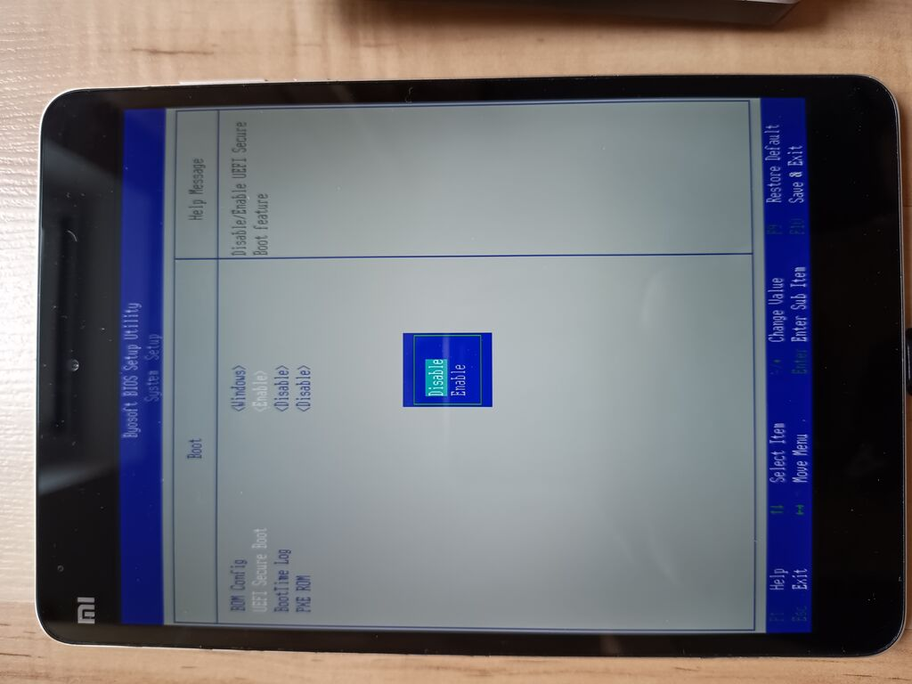
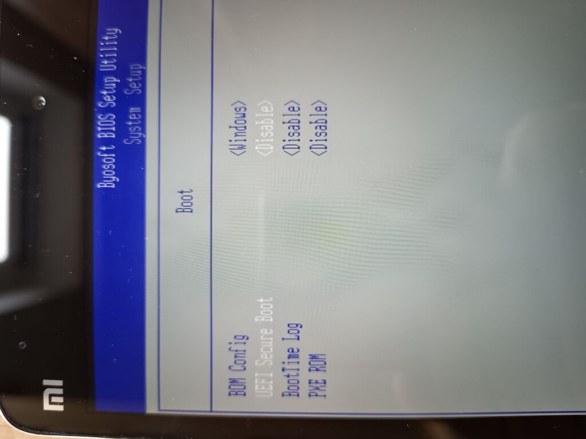
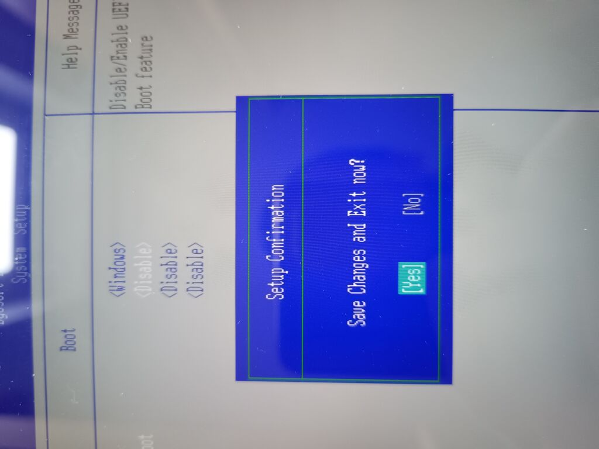
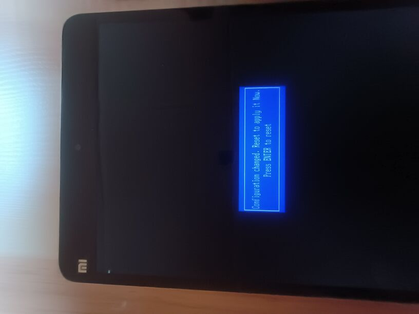

# Enjoy your new system
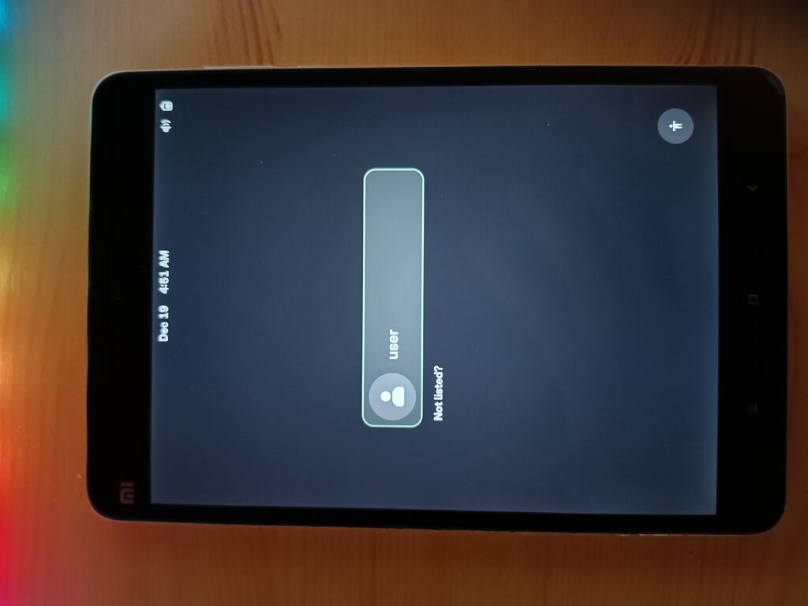
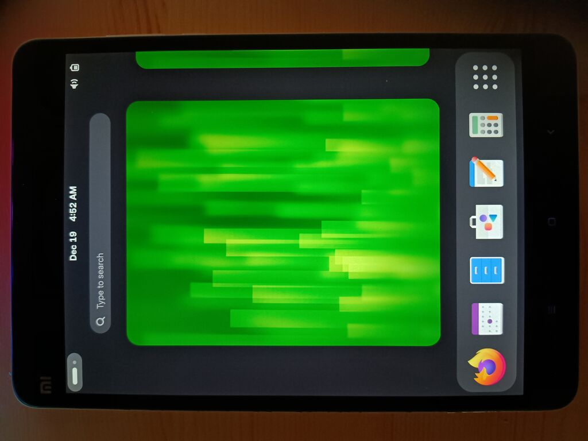
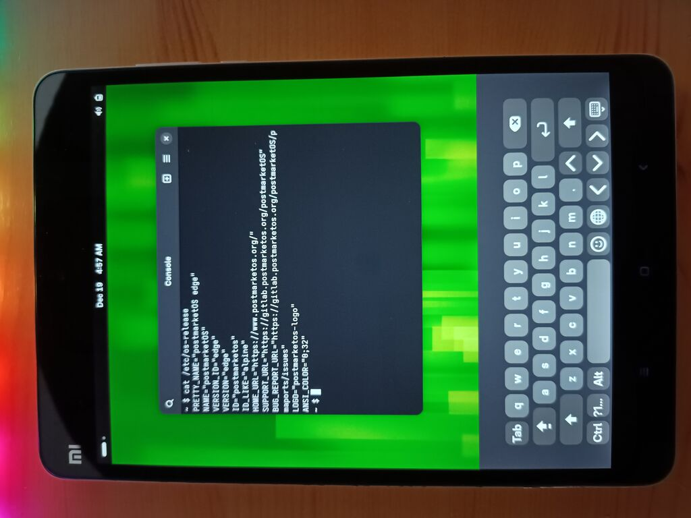

